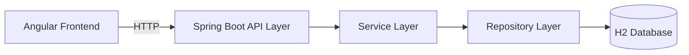
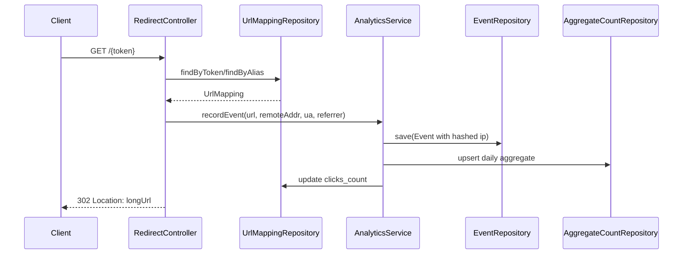

Artifact Name: Detailed Architecture
Repository Location: docs/architecture/detailed_architecture.md
Purpose: Provide a deep technical view of implemented architecture, component interactions, data model behavior, and operational concerns.
Created By: Engineering Review (AI-assisted)
Validation Status: Reviewed
Dependencies: docs/architecture/overview.md, openapi/openapi.yaml, src/main/java/com/aiassisted/urlshortener/*

---

# Detailed Architecture

## 1. System Context
The URL Shortener is a two-tier system:
- Backend: Spring Boot service exposing public and protected HTTP APIs.
- Frontend: Angular SPA for create, metrics lookup, and delete operations.

The backend is the source of truth for URL mappings and analytics state. The frontend is an operator-facing client.

## 2. Architectural Style
- Layered monolith on backend:
  - Controller layer for transport and HTTP semantics.
  - Service layer for business rules and orchestration.
  - Repository layer for persistence operations.
  - Exception handling layer for consistent API error envelopes.
- Single-page frontend consuming backend APIs over HTTP.

## 3. Module Breakdown

### 3.1 Backend Entry and Configuration
- Application bootstrap:
  - src/main/java/com/aiassisted/urlshortener/UrlShortenerApplication.java
- Runtime config:
  - src/main/resources/application.yml
- CORS + interceptor registration:
  - src/main/java/com/aiassisted/urlshortener/config/SecurityConfig.java
- API key enforcement:
  - src/main/java/com/aiassisted/urlshortener/config/ApiKeyInterceptor.java

### 3.2 API Layer
- URL creation endpoint:
  - src/main/java/com/aiassisted/urlshortener/controller/UrlShortenerController.java
  - POST /api/v1/shorten
- Redirect endpoint:
  - src/main/java/com/aiassisted/urlshortener/controller/RedirectController.java
  - GET /{token}
- Metrics endpoint:
  - src/main/java/com/aiassisted/urlshortener/controller/MetricsController.java
  - GET /api/v1/urls/{id}/metrics
- Management endpoint:
  - src/main/java/com/aiassisted/urlshortener/controller/ManagementController.java
  - DELETE /api/v1/urls/{id}

### 3.3 Service Layer
- URL shortening logic:
  - src/main/java/com/aiassisted/urlshortener/service/UrlShortenerService.java
  - Responsibilities:
    - Custom alias collision checks.
    - Secure random token generation for auto aliases.
    - Persistence of UrlMapping.
- Analytics logic:
  - src/main/java/com/aiassisted/urlshortener/service/AnalyticsService.java
  - Responsibilities:
    - Record redirect Event.
    - Hash remote IP using SHA-256 before storage.
    - Update daily AggregateCount.
    - Increment UrlMapping.clicksCount.
    - Compute unique visitors by distinct ip_hash.

### 3.4 Persistence Layer
- Entities:
  - src/main/java/com/aiassisted/urlshortener/model/UrlMapping.java
  - src/main/java/com/aiassisted/urlshortener/model/Event.java
  - src/main/java/com/aiassisted/urlshortener/model/AggregateCount.java
- Repositories:
  - src/main/java/com/aiassisted/urlshortener/repository/UrlMappingRepository.java
  - src/main/java/com/aiassisted/urlshortener/repository/EventRepository.java
  - src/main/java/com/aiassisted/urlshortener/repository/AggregateCountRepository.java
- Schema migration:
  - src/main/resources/db/migration/V1__init.sql

### 3.5 Error Semantics
- Global handler:
  - src/main/java/com/aiassisted/urlshortener/exception/RestExceptionHandler.java
- Typed exceptions:
  - src/main/java/com/aiassisted/urlshortener/exception/ResourceNotFoundException.java
  - src/main/java/com/aiassisted/urlshortener/exception/ConflictException.java
- Mapped responses:
  - Validation issues -> 400
  - Alias conflict -> 409
  - Missing resources -> 404
  - Missing/invalid API key -> 401

### 3.6 Frontend Layer
- Main UI component:
  - frontend/src/app/app.component.ts
  - frontend/src/app/app.component.html
  - frontend/src/app/app.component.css
- Behavior:
  - Create short URL request/response rendering.
  - Metrics request with X-API-KEY header.
  - Delete request with X-API-KEY header.
  - Feedback messages for success/failure cases.

## 4. Runtime Interaction Flows

### 4.1 Create Short URL
1. Client calls POST /api/v1/shorten with longUrl and optional customAlias.
2. Controller validates request DTO.
3. Service checks alias availability or generates token.
4. Repository persists UrlMapping.
5. Controller composes absolute shortUrl from request context.
6. Returns 201 response with id, alias, shortUrl.

### 4.2 Redirect and Analytics Capture
1. Client requests GET /{token}.
2. Redirect controller resolves token or alias in UrlMappingRepository.
3. On missing mapping: ResourceNotFoundException -> 404.
4. On hit: AnalyticsService records Event and updates counters.
5. Controller returns 302 with Location header to longUrl.

### 4.3 Metrics Lookup
1. Client calls GET /api/v1/urls/{id}/metrics with X-API-KEY.
2. Interceptor/controller validates API key.
3. Controller loads UrlMapping by id.
4. Metrics response uses:
  - clicks from UrlMapping.clicksCount
  - uniques from EventRepository distinct ip_hash count
5. Returns 200 with MetricsResponse.

### 4.4 Delete URL
1. Client calls DELETE /api/v1/urls/{id} with X-API-KEY.
2. Interceptor validates API key.
3. Controller deletes UrlMapping when present.
4. Returns 204 on success, 404 when already absent.

## 5. Data Design and Consistency

### 5.1 Tables and Intent
- urls
  - Primary short-link record.
  - Contains durable click accumulator clicks_count.
- events
  - Immutable click events for analytics traceability.
  - Stores hashed ip_hash, user_agent, referrer, occurred_at.
- aggregates
  - Daily per-url aggregation (clicks, uniques).

### 5.2 Counter Strategy
- Real-time redirect updates both:
  - urls.clicks_count (global total)
  - aggregates.clicks and aggregates.uniques (daily)
- Metrics endpoint currently reports global clicks_count + distinct ip_hash over events.

## 6. Security Posture
- Protected endpoints:
  - /api/v1/urls/** require X-API-KEY.
- Public endpoints:
  - POST /api/v1/shorten
  - GET /{token}
- Input controls:
  - Alias regex constraint in ShortenRequest.
- Privacy control:
  - Raw remote IP is transformed to SHA-256 hash before persistence.
- CORS:
  - Allowed origin includes http://localhost:4200 for local SPA access.

## 7. Operational Architecture
- Health and monitoring:
  - /actuator/health exposed.
- Persistence bootstrap:
  - Flyway migration executes at startup.
- Default profiles:
  - dev and test profile usage with H2 memory DB.

## 8. API Contract Alignment
Primary API contract source:
- openapi/openapi.yaml

Human-readable API summary:
- docs/api/api_contract.md

## 9. Test Architecture
- Backend integration tests:
  - src/test/java/com/aiassisted/urlshortener/UrlShortenerIntegrationTest.java
  - src/test/java/com/aiassisted/urlshortener/MetricsIntegrationTest.java
- Frontend unit test:
  - frontend/src/app/app.component.spec.ts

Covered paths include:
- create + redirect success
- alias conflict
- missing short URL not found
- protected metrics auth
- protected delete auth and idempotent not-found behavior
- metrics value assertions for clicks/uniques

## 10. Design Trade-offs
1. Shared API key auth simplifies prototype operations but is coarse-grained.
2. H2 in-memory data improves local speed but resets state on restart.
3. Unique visitor estimation by IP hash is practical but approximate.
4. Monolithic service is easy to reason about, with a clear future split path.

## 11. Extension Points
1. Replace API key with JWT/OAuth2 for fine-grained authorization.
2. Add rate limiting at API gateway or filter level.
3. Introduce cache (Redis) for hot token lookup.
4. Add asynchronous event pipeline for analytics scale.
5. Add production DB profile validation and migration checks in CI.

## 12. Architecture Diagrams

### 12.1 Logical Component Diagram


### 12.2 Redirect Sequence


### 12.3 End-to-End Workflow Diagram
```mermaid
flowchart TD
  A[User opens Angular UI] --> B[Submit longUrl and optional customAlias]
  B --> C[POST /api/v1/shorten]
  C --> D{Alias provided?}
  D -- Yes --> E[Validate format and uniqueness]
  D -- No --> F[Generate secure token]
  E --> G[Persist UrlMapping]
  F --> G
  G --> H[Return id, alias, shortUrl]
  H --> I[User opens shortUrl]
  I --> J[GET /{token}]
  J --> K[Resolve token/alias]
  K --> L{Found?}
  L -- No --> M[Return 404]
  L -- Yes --> N[Hash IP and save Event]
  N --> O[Update aggregates and clicks_count]
  O --> P[Return 302 redirect to longUrl]
  P --> Q[User enters id + API key in metrics panel]
  Q --> R[GET /api/v1/urls/{id}/metrics]
  R --> S{API key valid?}
  S -- No --> T[Return 401]
  S -- Yes --> U[Return clicks and uniques]
  U --> V[Optional delete action]
  V --> W[DELETE /api/v1/urls/{id} with API key]
  W --> X{Exists?}
  X -- Yes --> Y[Delete URL and return 204]
  X -- No --> Z[Return 404]
```
